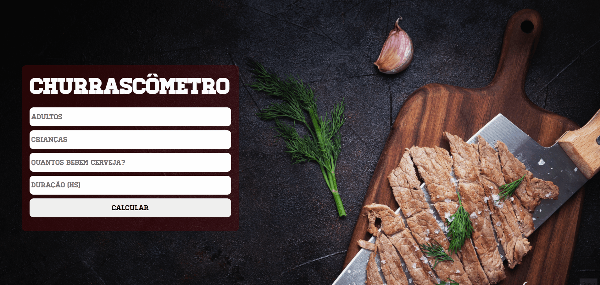

# Churrascômetro

Projeto desenvolvido no curso do ProgramadorBR

 

## Sobre o Projeto

<h1 align = "center">
    <a href = "https://churrascometro05.netlify.app/"> Clique aqui para acessar o site!! </a>
</h1>

Site que calcula a quantidade de carne e bebida necessárias para um churrasco.
 
O cálculo é realizado com base nos seguintes dados:

- Carne: 400g por pessoa | 650g caso dure mais de 6 horas | Metade para as crianças .
- Cerveja: 1200ml por adulto que bebe cerveja | 2000ml caso dure mais de 6 horas.
- Bebidas: 1000ml de Refrigerante/água por pessoa | 1500ml caso dure mais que 6 horas | Metade para as crianças.

## Tecnologias utilizadas 
- HTML
- CSS
- JavaScript
